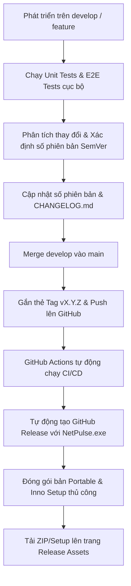

# Quy Trình Phát Hành Phiên Bản (Release Process) - NetPulse

Tài liệu này hướng dẫn chi tiết các bước thực hiện để phát hành một phiên bản mới cho ứng dụng **NetPulse**, từ việc phát triển trên nhánh `develop`, tích hợp vào nhánh `main`, gắn thẻ phiên bản (*tagging*), kích hoạt hệ thống kiểm thử tự động (CI/CD) trên GitHub Actions, cho đến việc tạo bản phát hành chính thức (*GitHub Release*) kèm bộ cài đặt.

---

## Sơ Đồ Quy Trình (Release Pipeline)



---

## Chi Tiết Các Bước Thực Hiện

### Bước 1: Kiểm thử và hoàn thiện trên nhánh `develop`
Trước khi bắt đầu quy trình phát hành, hãy đảm bảo mọi tính năng mới đã được kiểm thử đầy đủ và hoạt động ổn định trên máy cục bộ (*local*).
1. Chạy các kiểm thử tự động (Unit Tests & E2E Tests):
   ```powershell
   cmake --build build --config Debug
   cd build/tests
   .\NetPulseTests.exe
   .\NetPulseE2ETests.exe
   ```
2. Đảm bảo tất cả các test case đều vượt qua (Passed).

### Bước 2: Phân tích thay đổi và xác định số phiên bản (Semantic Versioning)
Trước khi nâng số phiên bản, bạn cần phân tích các thay đổi so với phiên bản phát hành liền trước để quyết định nâng chữ số nào theo chuẩn **Semantic Versioning (SemVer)**: `MAJOR.MINOR.PATCH`:

1. **Nâng số PATCH (`0.0.1`)** - *Ví dụ: từ 2.3.0 lên 2.3.1*:
   - Khi phiên bản mới chỉ chứa các sửa đổi nhỏ, sửa lỗi (*bug fixes*) tương thích ngược và không bổ sung tính năng mới lớn nào.
2. **Nâng số MINOR (`0.1.0`)** - *Ví dụ: từ 2.3.0 lên 2.4.0*:
   - Khi phiên bản mới chứa các tính năng lớn được thêm mới (như việc tích hợp bộ cài đặt Inno Setup hay cơ chế khóa an toàn Portable Mode) nhưng vẫn đảm bảo tính tương thích ngược hoàn toàn với phiên bản cũ.
3. **Nâng số MAJOR (`1.0.0`)** - *Ví dụ: từ 2.3.0 lên 3.0.0*:
   - Khi có các thay đổi cấu trúc mang tính phá vỡ khả năng tương thích ngược (*breaking changes*) hoặc thiết kế lại toàn bộ hệ thống lõi.

### Bước 3: Cập nhật số phiên bản và lịch sử thay đổi (Changelog)
Trước khi merge code, bạn cần cập nhật thông tin phiên bản mới `X.Y.Z` đã xác định từ bước 2 vào các tệp tin sau của dự án:
1. **`include/NetPulse/Common.h`** (Định nghĩa phiên bản trong mã nguồn):
   Cập nhật định nghĩa `APP_VERSION` ở dòng 41:
   ```cpp
   #define APP_VERSION L"X.Y.Z"
   ```
2. **`CMakeLists.txt`** (Cấu hình build hệ thống):
   Cập nhật cấu hình phiên bản tại dòng 14:
   ```cmake
   VERSION X.Y.Z
   ```
3. **`resources/app.rc`** (Thông tin tệp tin thực thi Windows và giao diện About):
   - Cập nhật FileVersion ở dòng 1008 và ProductVersion ở dòng 1013 (định dạng `X.Y.Z.0`).
   - Cập nhật nhãn hiển thị Dialog About ở dòng 1042:
   ```rc
   VALUE "FileVersion", "X.Y.Z.0"
   VALUE "ProductVersion", "X.Y.Z.0"
   LTEXT           "Version X.Y.Z",IDC_VERSION_TEXT,40,25,200,8
   ```
4. **`resources/app.manifest`** (Manifest của ứng dụng):
   Cập nhật thuộc tính version ở dòng số 3 (định dạng `X.Y.Z.0`):
   ```xml
   <assemblyIdentity version="X.Y.Z.0" ...
   ```
5. **`installer.iss`** (Bộ cài đặt Inno Setup):
   Cập nhật định nghĩa phiên bản ở dòng số 5:
   ```ini
   #define MyAppVersion "X.Y.Z"
   ```
6. **`CHANGELOG.md`**:
   Thêm tiêu đề cho phiên bản mới và liệt kê các thay đổi dưới các mục: `### Added` (Thêm mới), `### Changed` (Thay đổi), `### Fixed` (Sửa lỗi) để người dùng nắm rõ.
   *Ví dụ:*
   ```markdown
   ## [X.Y.Z] - YYYY-MM-DD
   ### Added
   - Mô tả tính năng mới...
   ```
7. Commit các thay đổi này lên nhánh `develop`:
   ```bash
   git add CHANGELOG.md installer.iss include/NetPulse/Common.h CMakeLists.txt resources/app.rc resources/app.manifest
   git commit -m "chore: update version to X.Y.Z and update changelog"
   git push origin develop
   ```

### Bước 4: Merge từ nhánh `develop` vào `main`
Nhánh `main` là nhánh đại diện cho các mã nguồn đã phát hành chính thức ổn định.
1. Chuyển sang nhánh `main` và lấy mã nguồn mới nhất:
   ```bash
   git checkout main
   git pull origin main
   ```
2. Thực hiện gộp (*merge*) từ nhánh `develop` vào nhánh `main` sử dụng cờ `--no-ff` (không chuyển tiếp nhanh - *non-fast-forward*) để giữ lại lịch sử nhánh:
   ```bash
   git merge develop --no-ff -m "Release vX.Y.Z"
   ```

### Bước 5: Gắn thẻ phiên bản (Tagging)
Gắn thẻ phiên bản (*tag*) trực tiếp trên commit merge của nhánh `main` để kích hoạt trigger tự động của GitHub Actions.
1. Gắn thẻ tag định dạng `vX.Y.Z` (chữ "v" viết thường ở đầu):
   ```bash
   git tag -a vX.Y.Z -m "Release version X.Y.Z"
   ```
2. *Lưu ý*: Luôn đảm bảo tên thẻ trùng khớp với phiên bản đã định nghĩa trong bộ cài đặt và CHANGELOG.
 
### Bước 6: Push mã nguồn và thẻ lên GitHub
Đẩy tất cả mã nguồn và thẻ tag lên kho lưu trữ từ xa (*GitHub repository*):
```bash
git push origin main
git push origin vX.Y.Z
```

---

## Hoạt Động Tự Động của GitHub Actions (CI/CD)

Khi bạn push thẻ tag `vX.Y.Z`, GitHub Actions sẽ tự động kích hoạt workflow được định nghĩa trong [.github/workflows/ci.yml](file:///c:/Users/yuhh/data/workspace/project/tools/NetPulse/.github/workflows/ci.yml):

1. **Job `build-and-test`**:
   - Biên dịch ứng dụng ở cả cấu hình `Debug` và `Release`.
   - Chạy toàn bộ các unit test để kiểm tra lỗi.
   - Đẩy tệp tin thực thi đã biên dịch hoàn chỉnh (`build/Release/NetPulse.exe`) lên kho lưu trữ tạm của GitHub Artifacts.
2. **Job `release`**:
   - Chờ job biên dịch hoàn thành thành công.
   - Tải tệp tin `NetPulse.exe` (bản Release) về.
   - Tự động tạo một bản phát hành mới trên trang GitHub Release ứng với tag `vX.Y.Z`.
   - Đính kèm tệp tin thực thi di động `NetPulse.exe` trực tiếp vào bản phát hành đó.
   - Tự động sinh mô tả bản phát hành (*release notes*) dựa trên lịch sử commit.

---

## Đóng Gói & Đính Kèm Bộ Cài Đặt & Bản Portable Thủ Công

Do các tệp tin cài đặt (`NetPulse_Setup.exe`) và tệp tin nén di động (`.zip`) cần được chuẩn bị trực tiếp trên Windows để đảm bảo tính nguyên bản, bạn cần đóng gói thủ công và tải lên trang phát hành GitHub Release.

### 1. Tạo Bản Nén Di Động (Portable ZIP)
Bản di động cho phép người dùng chạy ứng dụng trực tiếp từ bất kỳ thư mục nào (như USB hoặc Desktop) mà không cần cài đặt.
1. Biên dịch ứng dụng ở chế độ **Release** để tối ưu hóa hiệu năng:
   ```powershell
   cmake --build build --config Release
   ```
2. Đóng gói tệp tin thực thi `NetPulse.exe` (trong thư mục `build`) cùng với thư mục tài nguyên `resources` vào một tệp ZIP:
   Sử dụng lệnh PowerShell sau tại thư mục gốc của dự án:
   ```powershell
   Compress-Archive -Path build\NetPulse.exe, resources -DestinationPath NetPulse_Portable_vX.Y.Z.zip -Force
   ```

### 2. Biên Dịch Bộ Cài Đặt (Installer EXE)
1. Sử dụng trình biên dịch Inno Setup (`ISCC.exe`) để tạo file setup cài đặt:
   ```powershell
   & "C:\Users\yuhh\AppData\Local\Programs\Inno Setup 6\ISCC.exe" installer.iss
   ```
   *Lưu ý*: Lệnh này sẽ tự động đọc file `build\NetPulse.exe` và đóng gói thành tệp `NetPulse_Setup.exe` tại thư mục gốc của dự án.

### 3. Đính Kèm Vào GitHub Release

Bạn có thể tải các tệp tin đóng gói này lên GitHub Release bằng một trong hai cách sau:

#### Cách 1: Tải lên tự động bằng GitHub CLI (`gh` CLI) - Khuyên Dùng
Nếu máy của bạn đã cài đặt `gh` và được cấu hình xác thực, bạn có thể chạy lệnh sau tại thư mục gốc của dự án để tải trực tiếp các tệp tin lên Release đã tạo bởi GitHub Actions:
```powershell
# Cấu hình Token tạm thời từ Git credential helper nếu gh chưa được đăng nhập (hoặc chạy: gh auth login)
$env:GH_TOKEN = (echo "url=https://github.com" | git credential fill | Select-String "password=" | ForEach-Object { $_.Line.Split("=")[1] })

# Thực hiện upload các file assets lên release vX.Y.Z (thay X.Y.Z bằng phiên bản tương ứng)
gh release upload vX.Y.Z NetPulse_Setup.exe NetPulse_Portable_vX.Y.Z.zip --repo hoanghonghuy/NetPulse --clobber
```

#### Cách 2: Tải lên thủ công qua giao diện Web
- Truy cập kho lưu trữ GitHub tại địa chỉ: https://github.com/hoanghonghuy/NetPulse/releases.
- Tìm phiên bản `vX.Y.Z` vừa được tạo tự động bởi GitHub Actions, nhấn vào nút **Edit Release** (Chỉnh sửa bản phát hành).
- Kéo và thả hai tệp tin sau vào phần đính kèm tài nguyên (*Assets*):
  1. `NetPulse_Portable_vX.Y.Z.zip` (Bản chạy di động).
  2. `NetPulse_Setup.exe` (Bộ cài đặt hệ thống).
- Nhấn **Update Release** để hoàn tất việc cập nhật và công bố phiên bản mới đến người dùng.

---

## Hướng Dẫn Quay Trở Lại Nhánh Phát Triển
Sau khi hoàn thành việc phát hành, hãy quay trở lại nhánh `develop` để tiếp tục làm việc:
```bash
git checkout develop
git merge main  # Đồng bộ hóa commit merge ngược lại develop để tránh lệch nhánh
git push origin develop
```
